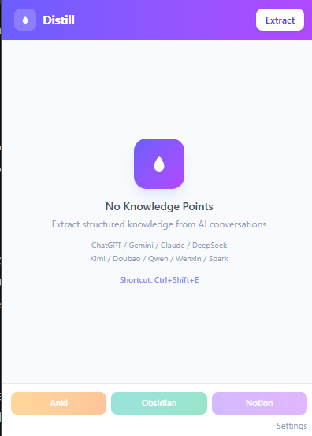
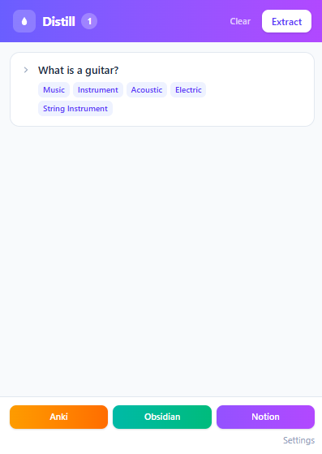
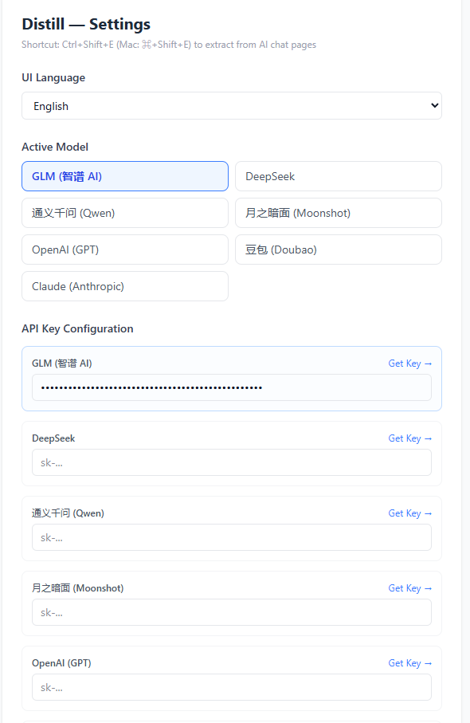
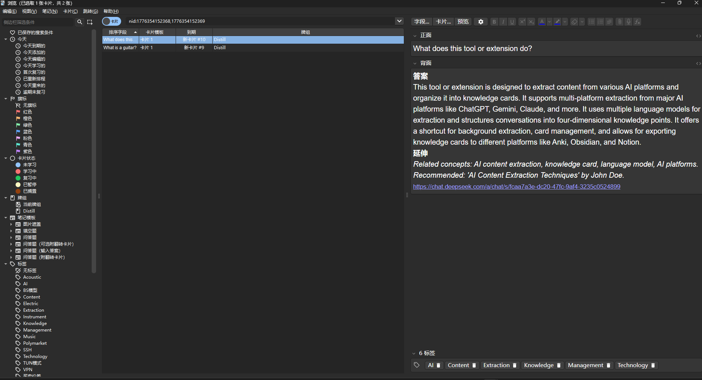

# Distill

> Distill AI conversations into structured knowledge cards / 将 AI 对话蒸馏为结构化知识点

Distill is a Chrome extension that extracts your AI conversations and uses LLMs to organize them into structured knowledge cards, with export support for Anki, Obsidian, and Notion.

Distill 是一个 Chrome 浏览器扩展，能够自动提取你与 AI 的对话内容，借助大语言模型将其整理为结构化的知识卡片，并支持导出到 Anki、Obsidian、Notion 等主流知识管理工具。

## 功能特性

- **多平台提取**：支持 ChatGPT、Gemini、Claude、DeepSeek、Kimi、豆包、通义千问、文心一言、星火等 9 大 AI 平台
- **多模型驱动**：可选 GLM、DeepSeek、通义千问、Moonshot、OpenAI、豆包、Claude 共 7 种 LLM 作为提取后端
- **AI 结构化**：将对话归纳为「问题 / 答案 / 延伸 / 标签」四维知识点
- **快捷键提取**：`Ctrl+Shift+E`（Mac: `⌘+Shift+E`）一键后台提取，无需打开 Popup
- **卡片管理**：查看、编辑、删除提取到的知识卡片
- **后台提取**：提取过程在后台运行，可关闭 Popup，完成后自动通知；重新打开 Popup 仍显示提取进度
- **多平台导出**：
  - **Anki**：导出 `.txt` 文件，直接 Import 生成闪卡
  - **Obsidian**：导出 `.zip`，每个知识点对应一个带 YAML frontmatter 的 Markdown 文件
  - **Notion**：导出 `.csv`，直接导入 Notion Database

## 支持平台

| AI 对话平台 | 域名 |
|------------|------|
| ChatGPT | chatgpt.com |
| Gemini | gemini.google.com |
| Claude | claude.ai |
| DeepSeek | chat.deepseek.com |
| Kimi | kimi.moonshot.cn |
| 豆包 | doubao.com |
| 通义千问 | tongyi.aliyun.com |
| 文心一言 | yiyan.baidu.com |
| 星火 | xinghuo.xfyun.cn |

## Screenshots / 界面预览

<table>
  <tr>
    <td align="center"><br/><b>Empty State</b></td>
    <td align="center"><br/><b>Extracted Cards</b></td>
    <td align="center"><br/><b>Settings</b></td>
  </tr>
</table>

<details>
<summary><b>Anki Export Preview / Anki 导出预览</b></summary>

</details>

## 安装与构建

### 前置要求

- Node.js 18+
- pnpm

### 步骤

```bash
# 克隆仓库
git clone https://github.com/blank-knight/Distill.git
cd Distill

# 安装依赖
pnpm install

# 构建插件
pnpm build
```

构建完成后，`dist/` 目录即为插件包。

### 加载到 Chrome

1. 打开 Chrome，地址栏输入 `chrome://extensions`
2. 开启右上角**开发者模式**
3. 点击**加载已解压的扩展程序**
4. 选择项目的 `dist/` 文件夹

## 配置

点击插件 Popup 底部的**设置**，进入设置页面：

### 模型选择

| 模型 | 默认模型 ID | 获取 API Key |
|------|------------|-------------|
| GLM（智谱 AI） | glm-4-flash | [open.bigmodel.cn](https://open.bigmodel.cn) |
| DeepSeek | deepseek-chat | [platform.deepseek.com](https://platform.deepseek.com) |
| 通义千问（Qwen） | qwen-turbo | [dashscope.console.aliyun.com](https://dashscope.console.aliyun.com) |
| 月之暗面（Moonshot） | moonshot-v1-8k | [platform.moonshot.cn](https://platform.moonshot.cn) |
| OpenAI（GPT） | gpt-4o-mini | [platform.openai.com](https://platform.openai.com/api-keys) |
| 豆包（Doubao） | 用户指定 Endpoint ID | [console.volcengine.com/ark](https://console.volcengine.com/ark) |
| Claude（Anthropic） | claude-haiku-4-5 | [console.anthropic.com](https://console.anthropic.com) |

### 其他设置

| 配置项 | 说明 |
|--------|------|
| 默认语言 | 知识点语言：跟随对话 / 中文 / English |
| 默认导出格式 | Anki / Obsidian / Notion |

配置完成后点击**测试 API Key** 验证可用性，再**保存设置**。

## 使用方法

### 提取知识点

**方式一：Popup 按钮**

1. 打开任意支持的 AI 对话页面，进行一段对话
2. 点击 Chrome 工具栏中的 **Distill** 图标
3. 点击 **提取知识点** 按钮
4. 等待 AI 处理完成（可关闭 Popup，后台继续运行）

**方式二：快捷键**

在任意支持的 AI 对话页面按 `Ctrl+Shift+E`（Mac: `⌘+Shift+E`），后台自动提取，完成后弹出系统通知。

### 管理知识卡片

- **展开 / 收起**：点击卡片查看完整答案和延伸内容
- **编辑**：悬停卡片右侧，点击铅笔图标修改任意字段
- **删除**：悬停卡片右侧，点击垃圾桶图标
- **清空**：点击头部「清空」按钮删除全部知识点

### 导出

#### Anki

1. 点击 **Anki** 按钮，下载 `distill-anki-xxxx.txt`
2. 打开 Anki 桌面客户端
3. 菜单 → **文件 → 导入** → 选择下载的 `.txt` 文件
4. 确认分隔符为 Tab，字段1=正面、字段2=背面，标签在第3列
5. 点击**导入**，闪卡自动创建完成

#### Obsidian

1. 点击 **Obsidian** 按钮，下载 `distill-xxxx.zip`
2. 解压到 Obsidian Vault 的任意文件夹
3. 每个知识点对应一个 `.md` 文件，包含完整 YAML frontmatter 和内容

#### Notion

1. 点击 **Notion** 按钮，下载 `distill-notion-xxxx.csv`
2. 在 Notion 中新建一个 **Database（Table 视图）**
3. 点击右上角 `···` → **Import** → **CSV** → 选择下载的文件
4. Notion 自动将各列映射为数据库属性（Question / Answer / Extension / Tags / Source / Created）

## 技术栈

| 层次 | 技术 |
|------|------|
| 框架 | React 19 + TypeScript |
| 构建 | Vite 8 + @crxjs/vite-plugin |
| 样式 | Tailwind CSS v4 |
| AI | Anthropic SDK / OpenAI-compatible API（适配 7 种模型） |
| 导出 | JSZip（Obsidian） |
| 扩展 | Chrome Extension Manifest V3 |

## 项目结构

```
src/
├── background/       # Service Worker
│   ├── index.ts      # 消息路由、提取编排、状态管理
│   └── extractor.ts  # AI 知识提取（多模型适配）
├── content/
│   └── content.ts    # 多平台对话抓取（9 个平台）
├── popup/            # 插件 Popup 界面
│   ├── main.tsx
│   └── components/
├── options/          # 设置页面
│   └── main.tsx
├── export/           # 导出适配器
│   ├── anki.ts
│   ├── obsidian.ts
│   └── notion.ts
└── types/            # 共享类型定义
```

## 当前限制

- Notion 导出为离线 CSV，暂不支持通过 Notion API 直接推送
- 部分平台在页面结构更新后可能需要适配选择器
